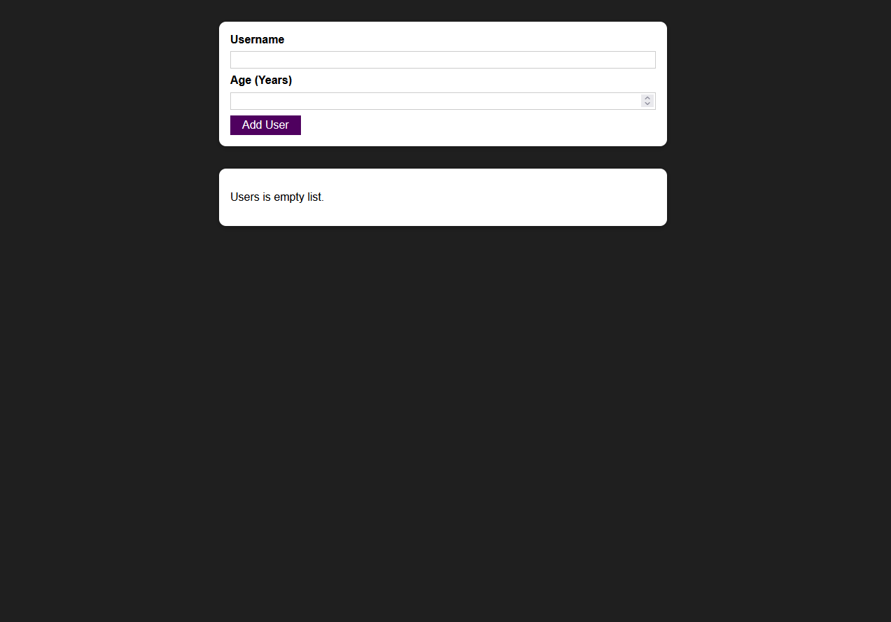

<p id="readme-top"></p>
<div align="center">
  <h3 align="center">Users</h3>

  <p align="center">
     Manage users list with React!
    <br />
    <br />
    <a href="https://users-react.vercel.app/">View a project demo</a>
  </p>



</div>

<!-- TABLE OF CONTENTS -->
<details>
  <summary>Table of Contents</summary>
  <ol>
    <li>
      <a href="#about-the-project">About The Project</a>
      <ul>
        <li><a href="#built-with">Built With</a></li>
      </ul>
    </li>
    <li>
      <a href="#getting-started">Getting Started</a>
      <ul>
        <li><a href="#installation">Installation</a></li>
      </ul>
    </li>
  </ol>
</details>

<!-- ABOUT THE PROJECT -->

## About The Project

You can only create users in a project..

<p align="right">(<a href="#readme-top">back to top</a>)</p>

### Built With

Technologies used:

- 
- 
- 
- 
- 
- 

<p align="right">(<a href="#readme-top">back to top</a>)</p>

<!-- GETTING STARTED -->

## Getting Started

1. Run server

```sh
  npm run dev
```

2. Run test

```sh
  npm run test
```

<p align="right">(<a href="#readme-top">back to top</a>)</p>
